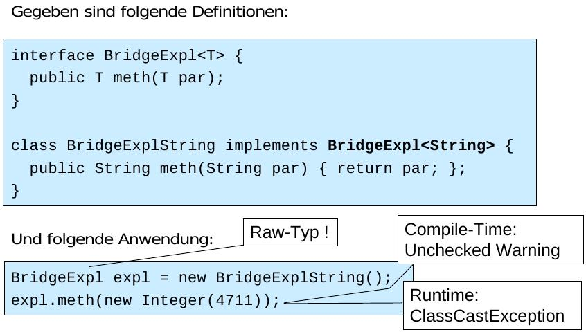
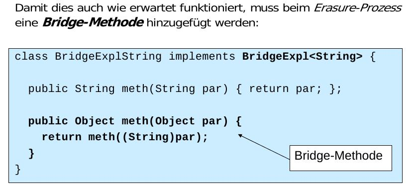

====================================
FS14 SE3 Repetitionsfragen Antworten
====================================

Dieses Dokument wird vorzu erweitert. Ergänzungen und Antworten sind herzlich willkommen.
Repetitionsfragen: https://github.com/moonline/HSR.modules.SE3/blob/master/RepetitionQuestions.rst

1 Java Advanced
===============

**1.0.1. Generische Schnittstellen bis Java 1.4**

Technische Umsetzung
	Für die Generalisierung wurde Object verwendet. Da alle Klassen implizit von Object ableiten, war die verwendung beliebiger Klassen möglich.
	
Zeitpunkt
	Die Typenprüfung fand zur Laufzeit statt und musste durch den Entwickler umgesetzt werden (typeof).
	
Folgen
	* Laufzeitfehler und eine fehlende Möglichkeit, bereits zur Kompilationszeit auf korrekte Verwendung zu überprüfen (Fehler treten zu spät auf)
	* Notwenigkeit einer aufwendige Dokumentation, da die Schnittstelle selbst nicht dokumentierte, welche Typen erlaubt waren
	

**1.0.2. Vorteil von Generics**

Der Compiler kann die Typensicherheit gewährleisten, sodass entsprechende Fehler nicht erst zur Laufzeit auftreten.

**1.0.3. Kompatibilität von Generics**

Nein. Weil man sonst der Studentenliste Objekte anfügen könnte -> Typensicherheit unterlaufen:

.. code-block:: java

	List<Object> ol = new ArrayList<Object>();
	ol.add(new Object());
	List<String> sl = new ArrayList<String>();
	sl.add(new String("Hallo"));
	
	ol = sl; // NICHT zulässig, da man aufgrund des statischen Types 
		 // "Object" von ol der Studentenliste "Objects" hinzufügen kann!
		 
		 
**1.0.4. Zuweisungen**

Die Variable muss vom gleichen oder einem abgeleiteten Typ sein:

.. code-block:: java

	Object o = new Object();
	String s = new String("Hallo");
	String p = s; // legitim da Type identisch
	Object q = s; // legitim da String von Object erbt
	String z = o; // NICHT legitim da Object kein Subtyp von String!
	
	List<String> ls = new List<String>();
	ls = new ArrayList<string>(); // legitim da ArrayList von List erbt.
	
	
List<Object> und List<String> sind zwei komplett andere Typen, auch wenn String von Object erbt!
Java löst Generics mit Casts, aber in C# wird für jede Generisch benutzte Klasse eine effektive Instanz vom Compiler erstellt.
Aus List<string> und List<Object> werden in C# List_string und List_Object, was eindeutig zeigt, das dies zwei unterschiedliche Klassen sind, die nur ähnlich heissen.

**1.0.5. Konsequenzen**

Weil dann eine mit List<Person> statisch typisierte Liste eine List<Student> enthalten würde, womit der Studentenliste Personen zugewiesen werden könnten!

**1.0.6. Beispiel**

Weil ArrayList ein Subtyp von List ist.
In C# würde die Klasse ArrayList_String von List_String ableiten. Dies zeigt, warum es geht.

1.1 Wildcards
-------------

**1.1.1 Wildcards**

Wildcards sind Platzhalter (?), die dazu dienen generische Klassen mit einem Typ zu generalisieren, der erst zur Compilezeit bekannt ist (z.B. eine Methode, die als Parameter eine Liste mit beliebigem Inhalt annimmt):

.. code-block:: java

	public function Log(List<?> list) {
		for(Object o : list) {
			logger.log(o.toString());
		}
	}

**1.1.2 Einschränkungen mit Wildcards**

Da die Methode mit einem beliebigen Typ verwendet werden kann, kann der Compiler nicht gewährleisten, das bei einer Zuweisung die Typen übereinstimmen:

.. code-block:: java

	public function Log(List<?> list) {
		list.add(new Object()); // NICHT gültig, da die Kompatibilität nicht klar ist
	}
	
	
**1.1.3 Upper/Lower bound Wildcard**

Upper Bound
	* "Oben gebunden"
	* ermöglichen das eingrenzen auf Subtypen
	* Nur lesenden Zugriff auf generische Klasse wie bei <?>
	* <?> = <extends Object>
	
	.. code-block:: java
	
		// Nur Strings oder subklassen erlaubt
		public function log(List<? extends String> list) {
			for(String s : list) { // gültig da eine Subklasse auch ein String ist
				logger.log(o.toString());
			}
		}
		
Lower Bound
	* "Unten gebunden"
	* ermöglichen das eingrenzen auf Elterntypen
	* Nur schreiben Zugriff auf generische Klasse, bei lesendem Zugriff nicht gewährleistet werden kann, das die Parent Klasse die verwendeten Methoden unterstützt.
	* Methoden, die nicht lesen nicht mit dem generischen Parameter parametrisieren, da sie sonst bei einem Lower Bound Wildcard nicht aufgerufen werden können
		
	  .. code-block:: java
	
		public boolean contains(Object c) {} // statt E
		
	
	.. code-block:: java
	
		public function log(List<? super String> list) {
			list.add(new String()); // gültig, da String garantiert eine 
			                        // Subklasse vom der Klasse des Genericparameters ist.
		} 
		

**1.1.4. Einschränkungen Wildcards**

Upper Bound
	Nur lesenden Zugriff auf generische Klasse
Lower Bound
	Nur schreibenden Zugriff auf generische Klasse
	
Erklärung siehe vorherige Frage.

1.2 Generische Methoden
-----------------------

**1.2.1. Generische Methoden**

Anstatt dem generalisieren von ganzen Klassen kann eine einzelne Methode einer nicht generischen Klasse typisiert werden:

.. code-block:: java

	class Logger {
		// ...
		public <T> void log(T element) {
			this.writeToLogFile(element.toString);
		}
		// ...
	}
	
Der Kompiler stellt aufgrund der aktuellen Parameter die Typensicherheit sicher!
Gäbe es generische Methoden nicht, müsste jeweils die ganze Klasse generalisiert werden und die gleiche Instanz könnte nicht mehr von verschiedenen Klassen genutzt werden.

1.3 Raw Types
-------------

**1.3.1. Raw Type**

Zur Abwärtskompatibilität entschieden sich die Java Entwickler, Generics mit Casts und nicht wie in C# mit einzel kompilierten Klassen zu lösen. Damit Generic Klassen weiterhin mit altem Code kompatibel waren, verwenden alle die gleiche Klasse.

Damit muss der Code auch ohne Angabe der <> kompilierbar sein, was zur Notwendigkeit von Raw Types führt.

1.4 Erasure
-----------

**1.4.1. Erasure**

Erasure bedeutet, das zur Compilezeit der generische Parameter entfernt und mit dem Upper Bound Typ ersetzt wird:

.. code-block:: java

	class Test<T> {
		T attr;
		public T getAttr() { .. }
		public void setAttr(T p) {.. };
	}

	// wird zu
	
	class Test {
		Object attr;
		public Object getAttr() { .. }
		public void setAttr(Object p) { .. }
	}
	
	
Wo notwendig, ergänzt der Compiler casts.

**1.4.2. Bridge Methoden**

Bridge Methoden verhindern eine "noSuchMethod" Exception mit falsch verwendetem Legacy Code:
Dazu wird eine generische Methode, die mit einem bestimmten Parameter typisiert wurde, zusätzlich mit einer Object-parametrisierten Methode überladen. So findet der Compiler in jedem Fall die Methode und wirft anschliessend eine Class Cast Exception.

   

   
**1.4.3. Class Sharing**

Da immer nur eine Klasse existiert liefert getClass immer den Raw-Type. Entsprechend ist folgender Code lauffähig:

.. code-block:: java

	// gäbe true zurück
	new List<String>()).getClass() == (new List<Integer>().getClass(); 
	  
	  
**1.4.4. new T()**

Der Compiler weiss nicht, ob der übergebene Typ einen Defaultkonstruktor besitzt da die formalen Parameter ja durch das Erasure entfernt wurden.

Alternativen:

* Objekt injecten (von aussen übergeben)
* Classtype übergeben und über Reflection instanziieren

2 Referenzen
============

**2.0.1. Nicht erreichbare Objekte**

Nicht mehr erreichbare Objekte werden vom GC erkannt und zum Abräumen gesammelt.

**2.0.2. Objektzuständer**

created
	Temporärer Zustand während Instanzierung
in use
	Objekt referenziert
invisible
	Noch referenziert, aber Referenz nicht sichtbar (selten)
unreachable
	Nicht mehr referenziert
collected
	Nicht mehr referenzierte und vom GC erkannte Objekte mit finalize() Methode
finalized
	Vom GC erkannt, für Objekte mit finalize() Methode wurde diese aufgerufen
	
	
**2.0.3. Resurection**

* Durch übergabe von this an ein erreichbares Objekt innerhalb von finalize() kann das Objekt wieder sichtbar gemacht werden -> Wiederauferstehung.
* Problem: finalize() wird nur einmal aufgerufen

2.1 Schwache Referenzen
-----------------------

**2.1.1. Schwache Referenzen**

Java Klasse, die Referenzen verkörpert, die der GC abräumen darf

**2.1.2. Referenz Typen**

Weak references
	Schwache Referenzen, dürfen vom GC abgeräumt werden
Soft references
	Schwache Referenzen, die vom GC abgeräumt werden dürfen, bevor das Memory ausgeht (OutOfMemoryException) -> älteste und am wenigsten benutzte zuerst
Phantom references
	Objekt nicht zugreifbar, finalize() wurde schon ausgeführt, Objekt wird jedoch erst gelöscht, wenn clear() aus der App heraus aufgerufen wird.
	
	
**2.1.3. Erreichbarkeiten**

strongly reachable
	Normal referenziert
softly reachable
	Über eine Kette von Soft- oder schwächeren Referenzen referenziert
weakly reachable
	Über eine Kette von Weak- oder schwächeren Referenzen referenziert
phantom
	Über eine Kette von Phantom Referenzen referenziert
unreachable
	Nicht erreichbar
	
	
**2.1.4. java.lang.SoftReference**

* Wrapper Klasse für Softreferenzen
* Unbekannt, ob Finalize schon aufgerufen wurde, wenn diese sich in der ReferenceQueue befindet

**2.1.5. java.lang.ref.WeakReference**

* Wrapper Klasse für Weakreferenzen
* Unbekannt, ob Finalize schon aufgerufen wurde, wenn diese sich in der ReferenceQueue befindet

**2.1.6. ReferenceQueue**

Der GC sammelt darin erkannte Objekte (unreachable oder softly, weakly oder phantom reachable)

**2.1.7. java.lang.ref.PhantomReference**

* Wrapper Klasse für Phantomreferenzen
* Kein Zugriff auf Objekt
* Finalize wurde garantiert schon aufgerufen, wenn diese sich in der ReferenceQueue befindet

**2.1.8. API**

gc()
	GC anstupsen (keine Garantie, das er wirklich startet)
runFinalization()
	finalize() für collection Objekte aufrufen
freeMemory()
	Speicher freigeben
totalMemory()
	Benutzter Speicher (VM)
maxMemory()
	Maximal der VM zur Verfügung stehender Speicher
addShutdownHook(Threak hook)
	Threads, die beim Runterfahren der VM aufgerufen werden sollen

3 AOP
=====

**3.0.1. AOP**

Aspektorientierte Programmierung ermöglicht das Zusammenfassen von Logik, die horizontal durch viele Bereiche der Applikation verteilt sind, z.B. Security, Logging.

Aspekte werden von einem Waver in den Code der Applikation eingewebt.

3.1 AspectJ
-----------

**3.1.1. PointCut, Advice, Aspect, JoinPoint**

JoinPoint
	Möglicher Einwebepunkt
PointCut
	Tatsächliche Einwebestelle (Filter auf JoinPoint)
Advice
	Einzuwebendes Snippet
Aspect
	Eingewobenes Snippet (PointCut+Advice = Aspect)

**3.1.2. execute & call**

Beide triggern den Aufruf einer Methode. Der Unterschied liegt jedoch im Kontext:

call()
	Kontext ist aufrufende Methode
execute()
	Kontext ist aufgerufene Methode
	

**3.1.3. arround()**

args(parameter)

.. code-block:: java

	double around(double a, double b): call(double Rectangle.calcArea(double, double) && args(a,b) {
		if(a > 2) {
			return proceed(a,b);
		}
	}

	
**3.1.4. thisJoinPoint**

"this" bezeichnet den Aspekt selbst. Darum muss auf den Kontext mit thisJoinPoint zugegriffen werden.

.. code-block:: java
	
	// Gibt die Klasse des Aspektes zurück
	Class thisJoinPoint.getThis()
	
	// Gibt die Aufrufargumente zurück
	Object[] thisJoinPoint.getArgs()
	
	// Gibt die aufgerufene Klasse zurück
	Class thisJoinPoint.getTarget()
	
	// Gibt den Typ des Aspekt zurücks (z.B. method-call)
	String thisJoinPoint.getKind()
	
	// Gibt die Signatur der Klasse zurück
	// z.B. double Square.calcArea(double)
	String thisJoinPoint.getSignature()
	
	
**3.1.5. target, args**

target()
	Filtert auf Zielobjekt zur Laufzeit, z.B. target(MyPackage.*)
args()
	Filtert auf Argumenttypen, z.B: args(double, int) oder args(a,b)
	
	
**3.1.6. PointCut Kombinationen**

!, &&, ||

.. code-block:: java

	call(* *(int)) && !call(* Square.*(int)) || call(* *(int)) && target(vehicles.Car)
	
	
** 3.1.7. Zugriffsrechte**

* Gleich wie normale Klassen, da Aspects Klassen entsprechen.
* Zugriff auf public Felder, priviledged Aspekte haben auch Zugriff auf private Felder.

5 Modellierung
==============

**5.0.1. Modelle**

Modelle sind Abbildungen der Realität und dienen der Beschreibung eines Originals.

**5.0.2. Eigenschaften eines Modells**

* Original
* Zweck
* Zielgruppe
* Notation
* Vereinfachung

**5.0.3. Modell Eigenschaften Beispiele**

1) Technische Zeichnung eines Segelschiffs
	Original
		Das "richtige" Segelschiff
	Zweck
		Herstellung des Schiffs, Dokumentation, Renovation
	Zielgruppe
		Bootsbauer, Werkstatt
	Vereinfachung
		keine Farben, nur Umrisse der Bauelemente, nur wichtige Teile dargestellt, Lange Teile in der Mitte gekürzt dargestellt
	Notation
		Technische Zeichnung nach VSM

2) Einrichtngsplan einer Wohnung
	Original
		Die einzurichtende Wohnung
	Zweck
		Einrichtungsvarianten ausprobieren
	Zielgruppe
		Der/die Einziehenden, die wahrscheinlich auch Autor des Plans sind
	Vereinfachung
		Wohnung und Möbel nur im Grundriss und als Umrisse dargestellt
	Notation
		Skizze: Wohnung und Möbel im Grundriss (Kein Standardisiertes Format)

3) Musiknoten
4) Elektrischen Schaltplan
		
**5.0.4. Modellieren & Programmieren**

Das Programm (Source Code) ist wiederum ein Modell des später ablaufenden Binärcodes.
Das UML Modell ist das Modell des Source Codes.

**5.0.5. Zachmann Framework**

Ist ein Modellsammelkasten, aus dem in jedem Modell ein Subset zum Einsatz kommt.

**5.0.6. Modellasprekte in der SW-Entwicklung**

* Zweck
	* Konstruktive Modelle: Spezifikation
	* Analytische Modelle: Illustration von Aspekten
* Statische/dynamische Modelle
* Black Box/Glasbox Modelle

**5.0.7. Modelle**

Dynamische/Statische Modelle
	Zeigen Verhalten/Zustände
Blackbox/Glasbox
	Systeme nur von Aussen/Systeme inkl. innerer Aufbau
Konstruktive/Analytische
	Spezifikation/Illustration von Aspekten
	
	
**5.0.8 Eindeutigkeit, Vollständigkeit, Ausführbarkeit**

