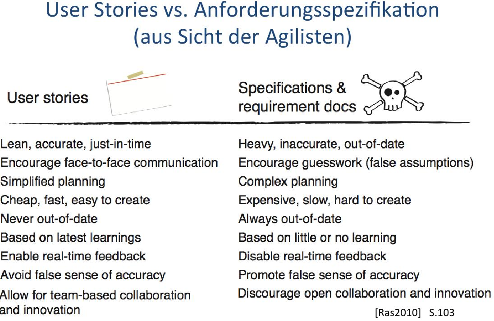
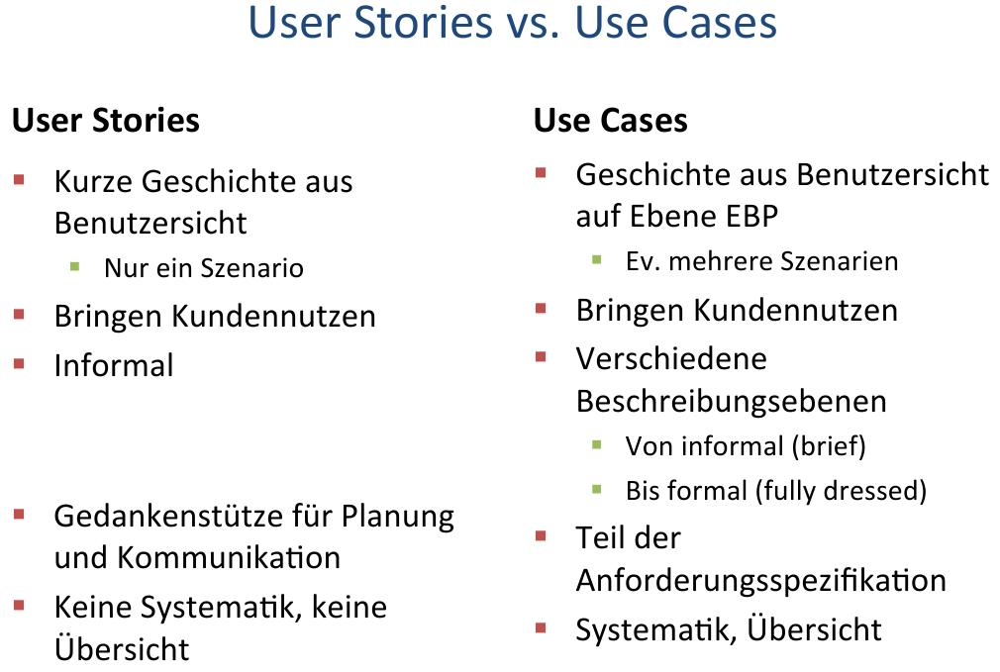

================
FS14 SE3 Summary
================

1 Java Advanced
===============

* Modellierung: Sicherheit sehr entscheidend (z.B. Typisierung, ...) und beeinflusst die Entscheidungen während der Modellierung.

::

	Compile
	    Linking
	        Runtime
	------------------> t

* Fehlerfall soll so früh wie möglich auftreten (Kompilierung), nicht beim Linking oder zur Runtime.
* Beim Design kann oft entschieden werden, zu welcher Zeit Fehler auftreten (z.B. Typisierte Liste oder untypisierte).

1.1 Generics + Vererbung
------------------------

.. image:: img/1.1.jpg

.. image:: img/1.2.jpg

* Generics führen dazu, das falsche Datentypen zur Compilezeit und nicht zur Laufzeit auftreten!

* UML Varianten
	* Formaler Paramter geht über in Person: <<bind>> <E -> Person> auf der implementationslinie zwischen List und RealList
	* Nur RealList Klasse: RealList : List<E -> Person>
* Legale Zuweisung: wenn vom gleichen Typ oder von abgeleiteten Type (wenn b auch ein a ist) -> String ist auch ein Object.
	
* Beispiel1
	.. code-block:: java

		List<String> ls = new ArrayList<String>();
		List<Object> lo = ls;
		
		// Zuweisung ist nicht legal auch wenn vom gleichen Typ 
		// oder von abgeleiteten Type

* Beispiel2
	::
	
		List<Student> ls = ...
		List<Person> lp = ...
		lp = ls; 	// Illegal, weil statischer Typ Person und damit der 
				// Studentenliste Angestellte hinzugefügt werden 
				// können. -> unterlaufen der Typisierung.
		
		
* Beispiel3
	.. code-block:: java
	
		void printCollection(Collection<Object> o) { 
			// ...
		}
		Collection<Person> persList;
		
		// ...
		
		// Parameterübergabe entspricht Zuweisung!! da call by value
		printCollection(persList); // Error, da Collection<Person> != Collection<Object>
		
		
	.. code-block:: java
	
		Wil
		void printCollection(Collection<?> o) { 
			// ...
		}

* **Student ist eine Person ABER Studentenliste ist keine Personenliste.**
* **G<Derived> ist kein abgeleiteter Typ von G<Base>**

.. image:: img/1.3.jpg

1.2 Wildcards
-------------

.. image:: img/1.4.jpg

.. image:: img/1.5.jpg

* <?> entspricht <? extends Object>

1.2.1 Upper Bound Wildcard
..........................

* Erlaubt sind Person oder tiefer (Student, ...)

.. code-block:: java

	List<String> erzeugeNamensList(List<? extends Person> personenListe);
	
	

* Schreibender Zugriff nicht erlaubt, weil damit falsche Typen in List eingetragen werden könnten.
* Compiler löst dies, in dem er alle Methoden verbietet, die den Typ in der Parameterliste führen.

1.2.2 Lower Bound Wildcard
..........................

* Erlaubt sind Studenten oder höher (Person, Objekt, ...)

.. code-block:: java

	List<String> erzeugeNamensList(List<? super Student> personenListe);

* Problem: Funktionen von Tiefer Klassen könnten in höherer Klasse nicht vorhanden sein -> KEIN lesender Zugriff.
* Compiler löst dies, in dem er alle Methoden, die den Typ zurückgeben (z.B. get(0)) verbietet.

1.2.3 Zusammenfassung Lower/Upper-Bound
.......................................

**-> keine Methoden Typisieren, die gar nichts mit dem Objekt machen, weil diese sonst bei upper oder lower bound nicht mehr verfügbar wären.**

.. code-block:: java

	public boolean contains(Object o); // statt E

1.3 Generische Methoden
-----------------------

1.4 Raw Type
------------

.. image:: img/1.10.jpg

1.5 Erasure
-----------

.. image:: img/1.12.jpg

1.5.1 Bridge Methoden
.....................

.. image:: img/1.13.jpg

VM Müsste eine noSuchMethod Exception werfen, weil durch die Übergabe des Integers nach einer Methode mit Integer Signatur gesucht wird. Damit dies nicht passiert, wird eine Bridge Methode generiert.

Die Bridge Methode Enthält Object in der Signatur und versucht anschliessend zu Casten.

.. image:: img/1.14.jpg

1.5.2 Class Sharing
...................

.. code-block:: java

	List<String> l1 = new ArrayList<String>();
	List<Integer> l2 = new ArrayList<Integer>();
	System.out.println(l1.getClass() == l2.getClass()); // true
	

Alle Instanzen einer generischen Klasse benutzen die durch Erasure erzeugte, einzige Klasse !
Somit ist auch Interoperabilität von Generic- und Legacy-Byte-Code sichergestellt !

1.5.3 new T()
.............

* Wird von Java nicht zugelassen, da der Compiler nicht garantieren kann, das T einen Defaultkonstruktor besitzt. -> Cannot instantiate the type T
*  Aufgrund des Erasure würden die formalen Typ-Parameter durch Object (resp. durch einen allfälligen Upper-Bound ) ersetzt:

	.. code-block:: java
	
		MyClass<String> mc = new MyClass<String>();
		String str = mc.getData(); // String = Object -> ClassCastException

1.5.3.1 Mögliche Alternativen
'''''''''''''''''''''''''''''

a) Objekt wird von aussen übergeben: Nachteil: Datenkapselung wird umgangen.
	
	.. code-block:: java
	
		class MyClass<T> {
			private T data;
			MyClass(T data) {
				this.data = data;
			}
		}

	

b) Classtype wird übergeben und mittels Reflection eine Instanz erzeugte
	
	.. code-block:: java
	
		class MyClass<T> {
			private T data;
			MyClass(Class<T> dataType) throws Exception {
				data = dataType.newInstance();
			}
		}

	

2 AOP
=====

.. note:: AOP: Aspect Oriented Programming

2.1 Separation of concerns
--------------------------

* Code wird zentral definiert und anschliessend in die Applikationslogik eingewebt. -> Einzelne Gebiete/Belange werden voneinander getrennt.

2.2 AspectJ
-----------

* **JoinPoints**: Mögliche Einwebestellen
	* Constructor-/ Methodenaufruf
	* Attributzugriff
	* Exceptionbehandlung
* **Pointcut**: Definitionen, wo eingewoben werden soll
* **Advice**: Eingewobenes Snippet
* **Aspect**: An best. Stelle eingewobenes Snippet (Pointcut+Advice)

.. code-block:: java

	public class Entry {
		protected User author;
		protected User owner;
	
		public void Entry() { /* ... */ }
		
		public void edit() { /* ... */ }
		public void view() { /* ... */ }
	}
	
	
.. code-block:: java

	public aspect EntryAccess {
		pointcut edit() : call(* Entry.edit(..));
		
		// Methodenaufruf nur erlauben, wenn User Owner ist
		around(): edit() && target(entry) {
			if(Context::getUser() == (Entry) entry.owner) {
				proceed();
			}
		}
	}

3 References
============

.. figure:: img/3.1.jpg

   Für das Programm nicht mehr erreichbare Objekte werden vom Garbage-Collector automatisch gefunden und freigegeben.

3.1 Lebenszyklus eines Objekts
------------------------------

.. figure:: img/3.2.jpg

3.2 Resurection
---------------

Innerhalb von finalize() kann das Objekt wieder erreichbar gemacht werden (z.B. Übergabe von this an ein erreichbares Objekt welches diese Referenz dann wieder speichert)!

**Resurrection (Wiederauferstehung)**

**Beachte:**
Die finalize()-Methode wird vom Garbage-Collector garantiert nur einmal aufgerufen. Dies ist bei bewusster Resurrection zu berücksichtigen!

3.3 Schwache Referenzen
-----------------------

.. figure:: img/3.5.jpg

   java.lang.ref.Reference

* **Weak-Referenzen** Lösche Objekt sobald es von der Applikation nicht mehr referenziert wird.
* **Soft-Referenzen** Behalte Objekt so lange es geht. Lösche erst, wenn nicht mehr genügend Memory vorhanden ist."
* **Phantom-Referenzen** Benachrichtige mich bevor das Objekt gelöscht wird.

.. figure:: img/3.7.jpg

   Erreichbarkeit

3.4 Soft Reference
------------------

* Nur über Soft- oder schwächere Referenzen erreichbar. -> Kann vom GC abgeräumt werden da softly reachable
* Bevor eine OutOfMemory-Exception geworfen wird, müssen alle softly-reachable Objekte weggeräumt sein.
* Alte und wenig benutzte Objekte sollen zuerst gelöscht werden

3.5 WeakReference
-----------------

* Objekte, die nur über Weak- oder schwächere Referenzen erreichbar sind
	* -> können vom GC abgeräumt werden.

.. figure:: img/3.9.jpg

   WeakReference Beispiel: Singleton

3.6 ReferenceQueue
------------------

* Eine Referenz-Queue erlaubt es dem Programm herauszufinden, wann ein Objekt Soft-, Weak- resp. Phantom-Reachable wird.
* Objekt Ref. Kommt in schwachen Zustand -> GC schreibt es in Queue

3.7 PhantomReference
--------------------

* Spezialfall der schwachen Referenzen
* Erlauben keinen Zuriff auf das eigentliche Objekt
* Wenn Objekt Phantom reachable wird, ruft der GC finalize() auf und verschiebt die Referenz in die die ReferenceQueue
* Unterschied zu Soft- und Weak Referenzen: Diese werden in die Queue geschrieben, sobald sie "collected" sind. -> man weiss nicht, ob finalize() schon ausgeführt wurde wenn man sie aus der queue ausliest.
* GC löscht Objekt erst, wenn aus der App heraus darauf clear() aufgerufen wird.

3.8 Runtime
-----------

.. image:: img/3.11.jpg

4 Agile Entwicklung
===================

   RUP zur Repetition

.. image:: img/4.2.jpg
   :width: 90 %
   
   
4.1 Scrum
---------

* Iterativ wie RUP
* Sprints entsprechen Iterationen
* Sprintziele sollten während Sprint nicht verändert werden
* Sprint dauert bis zu Monat
	* Rhytmus finden

	
Rollen
......

.. image:: img/4.6.jpg
   :width: 60 %
   :align: left

* Product Owner 
	* Vertritt Interessen des Auftraggebers
	* priorisiert Backlog
* Product Backlog
	* Beinhaltet Features, die umgesetzt werden soll, ev. auch User Stories
* Scrum Master
	* Coached das Team
	* Steht bei Problemlösung zur Seite
	* Kein Projektleiter! sondern eine DL für das Entwicklungsteam
* Team
	* Ist als ganzes verantwortlich dafür, das die Software entwickelt wird
	* ist selbstorganisiert

	
Meetings / Vorgehen
...................

.. image:: img/4.7.jpg
   :width: 90 %

* Team schätzt Aufwand für Backlog Features
* Product Owner kann nur Backlog priorisieren, aber nicht definieren, was in Sprint alles gemacht werden soll. Das Team definiert, was drin liegt.
* Aus Backlog entstehen Tasks, die nicht länger als einen Tag dauern sollen
* Tägliche Scrum Meetings (bis zu 15')
	* Jedes Teammitglied teilt mit, was es gemacht hat und wo es Probleme gibt
	* Stand-up Meeting, damit es nicht ausartet
	* Product Owner nicht dabei
* Sprint Review
	* Mit Product Owner

Ergebnisse
..........

Prinzipien
..........

.. image:: img/4.5.jpg
   :width: 90 %

4.2 Agiles Manifest
-------------------

* Zusammenarbeit zwischen Personen ist wichtig
* Funktionierende Software ist wichtiger als umfangreiche Doku
* Zusammenarbeit mit Kunden ist wichtiger als juristische Absicherung
* Reagieren auf Änderungen ist wichtiger als striktes Folgen des Planes
* Selbstorganisierende Teams, Vertrauen
* Architektur darf trotzdem nicht vergessen werden

4.2.1 Prämisse agiler SoDwareentwicklung
........................................

1) Es ist nicht möglich, alle Anforderungen zu Projektbegin zu erfassen
2) Anforderungen ändern sich während dem Projekt
3) Es gibt immer mehr zu tun als Zeit und Geld zur Verfügung stehen

4.2.2 Agile Planung
...................

4.2.3 Ziel jeder Iteration
..........................

* Nutzen (lauffähiges Produkt) für Kunden liefern

4.2.4 Fortschritt an "Working Software" messen
..............................................

.. image:: img/4.11.jpg
   :width: 90 %

4.2.5 Agiles Team
.................

   

* Team ist für das ganze verantwortlich
* Jeder übernimmt jede Rolle, was gerade zu tun ist
* Keine "Siloverarbeitung"
* Leute, die nur Fachidioten sind können nicht gebraucht werden

4.2.5 Erfolgsfaktoren für agile Teams
.....................................

.. image:: img/4.13.jpg
   :width: 90 %

4.2.6 Inception Desk
....................

4.3 User Stories
----------------

* Softwareanforderung aus Benutzersicht
* Kurz (1-2 Sätze)
* Sagt nur, um was es geht

::

	As a <type of user>,
	I want <to perform some task>
	so that I can <achieve some goal/benefit/value>.
	

   Gute User Stories bringen Wert für Kunden

* User Stories sollten über alle Schichten laufen
* User Stories müssen unabhängig sein -> Priorisierung durch Product Owner möglich
* User Stories sind klei und lassen sich gut schätzen

.. note:: User Stories werden erst zum Moment der Umetzung ausgearbeitet

Story-Gathering Workshop
........................

.. image:: img/4.21.jpg

5 Aufwandschätzung & Planung
============================

* Schätzung zu Projektbegin: Keine genaue Aufwandabschätzung sondern
	* ungefähr Rescourcen und Zeit
	* ist das Projekt realistisch?

.. figure:: img/5.1.jpg
   :width: 90 %

   The Cone of Uncertainity

Agiles Schätzen
---------------

.. image:: img/5.2.jpg
   :width: 90 %

* relative Schätzungen einfacher als absolute
* User Stories im Team schätzen (Mit Story Poinst statt Personentagen rechnen)
	* Punkte definieren Grösse der Aufgabe, nicht direkt Zeitdauer

* Schätzung erweist sich als falsch -> neu schätzen
	* Relative grösse der User Story bleibt -> nicht neu schätzen -> Burndown Rate erhöhen
* Schätzen nicht möglich -> Prototyp bauen in nächster Iteration
* Grosse Stories unterteilen

Agile Planung
-------------

.. image:: img/5.5.jpg
   :width: 90 %
   

Statische Planung vs Agile Planung
..................................

   
   
Agile Planen
............

.. figure:: img/5.8.jpg
   :width: 90 %
   
   Flexibilität des Umfangs: Kommen neue Elemente hinzu, müssen alte raus!

Der Plan
........

1) Master Story List erstellen
2) Ersten Release planen
3) Schätzen
4) Priorisieren
5) Team Geschwindigkeit schätzen (Stories / Iteration)
6) Festlegen auf Termin oder Umfang

   Burn Down Rate in der Praxis

.. figure:: img/5.11.jpg
   :width: 80 %
   
   Burn Down Rate mit neuen Features

6 Agile Entwicklungsmethoden & Management
=========================================

.. figure:: img/6.1.jpg
   :width: 80 %
   
   Technical Debt
   

* Test Driven Development (Hohe Testabdeckung)
* Continious Integration (Kontinuierliches Zusammenführen der lokalen neuen Features der einzelnen Entwickler um das Zusammenspiel im Auge zu behalten)

Managment agiler Projekte
-------------------------

* Analyse & Design nur für das durchführen, was gebraucht wird -> JIT Analyse für den Rest

Iteration Plannin Meeting IPM
.............................

* Am Ende der Iteration
* Besteht aus
	* Scrum Sprint Review
	* Planning next iteration
		* Stories müssen vorher geschätzt, priorisiert und analysiert worden sein
		* Festelgung der Stories für nächste Iteration
		* Kunde + Team zusammen
	* Allgemeinen Rückblick
		* Mini Project Health Check

Daily Stand Up Meeting
......................

Jeder berichtet:

* Was er gestern getan hat
* Was für heute geplant ist
* Was behindert die Arbeit

7 Modelle
=========

Modelle sind vereinfachende Beschreibungen eines Originals, die zu einem bestimmten Zweck erstellt wurden.

Eigenschaften Modell
--------------------

* das Original
* die Vereinfachung -> Was wird umgesetzt, was wird weggelassen
* der Zweck
	* deskriptiv, zur Analyse eines Systems
	* präskriptiv, zum Bau eines Systems
* die Zielgruppe
* die Notation
	* graphisch
	* textuell
	* Kombination

.. note:: Typischerweise sieht man bei einem Modell mehr NICHT als man sieht.

Modell Beispiele
----------------

* Deployment-
* Activity-
* Architektur-
* State-
* Daten-
* Lego-
* 3D Printing
* Rpaid Prototyping

Zweck von Modellen
------------------

.. note:: Grund für Modelle: Ausprobieren mit realem System meist zu teuer oder nicht möglich.

* Komplexität verstehen
* Modell ist bewusster Entscheid, auf bestimmte Aspekte zu verzichten und sich auf bestimmte zu fokusieren
* Optimierung
* Geldgeber überzeugen
* Simulation von verschiedenen Parametern

.. note:: Unterscheidung zwischen Businessmodel und Softwaremodell bei Gespräch mit Kunden wichtig -> Modelle dürfen nicht vermischt werden

* Konstruktive Modelle
* Spezifikation zu bauender Systeme
* Input für Code-Generatoren
* Analytische Modelle
* Illustration von Aspekten zu bauender Systeme
* Verständnis existierender Systeme

Model & Realität/Original
-------------------------

* Modelle bestehen aus verschiedenen Abstraktionsgraden

.. note:: Unterschied Programmieren / Modellieren: Laufendes Programm ist Realität. Programmcode ist Modell des Binary (Model Driven Architecture). UML ist Modell des Codes. -> Jedes Modell beschreibt relativ zu einer andern Stufe wie das System aufgebaut ist.

::

	          .---------.
	          |   UML   |
	          |    v    |
	 Model    |  Code   |
	          |    v    |
	          | Binary  |
	          '---------'
	               |
	               v
	Realität   Laufendes
	           Programm

Zachman	Framework
.................

   Modellsammelkasten von Zachman (Zum Einsatz kommt jeweils ein Subset)

Typen von Modellen
------------------

* Blackbox Modelle: Anwendungsfallmodelle, gewisse Sequenzdiagramme, Reguläre Ausdrücke
* Glassbox Modelle: Klassenmodelle, Zustandsmaschinen, Petri-Netze

--

* Statische Modelle: Datenmodelle, Klassenmodelle, Deployment Modelle, Structure Charts
* Dynamische Modelle: Zustandsmaschinen, Sequenzdiagramme, Aktivitäts-/Flussdiagramme

--

* Konstruktive Modelle: Klassenmodelle, Objektdiagramme (teilweise), Zustandsmaschinen, Anwendungsfallmodelle (teilweise)
* Analytische Modelle: die meisten Sequenzdiagramme, Timing-Diagramme

Vom Modell zum Programm
-----------------------

8 Model Driven Enterprise Engineering
=====================================

   Untere Hälfte ist Unterstützung, die IT zur Erfüllung des Business bereitstellt

:Operationelles Model: setzt Strategiemodel um
:IT-Support-Model: Setzt Strategiemodel technisch um
:Technologie-Model: Zeigen IT-Umsetzung

   
   MDEE Beispiel

   MDEE Technologien

Business Motivation Model
-------------------------

* **End**: Was will ich? Marktstrategie
* **Influencer**: Wie sieht die Umwelt aus? Was darf ich, was kann ich?

9 Requirements
==============

.. note:: Glossar: Mit kleinstem Aufwand am meisten Klärung schaffen. Glossar erklärt, was welche Objekte sind und was darunter verstanden wird.

* Warum sind Anforderungen wichtig?
	* Unklar was gemacht werden soll
	* Was soll geliefert werden was wird bezahlt
	* Rahmen abstecken was dazugehört und was nicht
* Folgen von Mangelhaften Anforderungen
	* Kunde dehnt Scope aus
	* Architektur nicht stabil
* Gründe für unzulängliche Anforderungen
	* Projekt Scope am Anfang unbekannt
	* Projekt wird unterschätzt

.. note:: So wenig wie möglich, so viel wie nötig.

   Analyse Prozess

.. note:: Eine Anforderung beschreibt eine oder mehrere **gewünschte Eigenschaften** oder **gewünschte Verhaltensweisen** eines Systems.

   Aspekte von Anforderungen.

.. note:: Was ist das System? Für den Kunden ist das System meist alles, was auf dem Schirm zu sehen ist.

.. warning:: Keine Anforderungen an die Software, die auch Prozesse des Kunden beinhalten -> genau klären, was das System ist.

* Unklares System
	* Oft ist von Beginn an nicht klar, was der Betrachtungsgegenstand ist, von welchem System die Rede ist:
		* Das Geschäft?
		* Eine Abteilung?
		* Die ganze Informatik?
		* Eine einzelne IT-Anwendung?

		
Qualitätsmerkmale einer Anforderungsbeschreibung
------------------------------------------------

Gute Anforderungsbeschreibungen sind

* klar und verständlich
* eindeutig
* vollständig
* abgestimmt
* bewertet
* gültig und aktuell
* korrekt
* konsistent
* prüfbar
* realisierbar
* verfolgbar
* geschäftsbezogen
* nicht zu technisch

.

.. note:: Im Gespräch mit dem Kunden: Ein Beispiel machen oder überlegen, wie man es testet. -> Verhindern, das der Kunde sein eigenes Problem nicht versteht.

Zusätzliche Eigenschaften von Anforderungen
-------------------------------------------

* ID (Anforderungen nummerieren)
* Typ (Definieren ob f (Verhalten) oder nf (Eigenschaft)
* Priorisierung
* Zuständigkeit / Verantwortlicher
* Status (Bearbeitungstand der Anforderung)
* Grund
* Thema (Dient zur Gliederung)
* Verweise

Abgrenzung Ziel/Anforderung
---------------------------

* Anforderung
	* beschreibt eine Eigenschaft oder Verhalt eines Systems
	* ist auf den Betrachtungsgegenstand gerichtet
	* Blickrichtung nach "innen"
* Ziel
	* beschreibt eine Wirkung oder Folge, die aus der Verwendung des Systems entsteht
	* ist auf das Umfeld des Betrachtungsgegenstands gerichtet
	* Blickrichtung nach "aussen"

Quellen von Anforderungen
-------------------------

Was nicht wie
-------------

* Tendenz, eine Lösung zu beschreiben und nicht eine Anforderungen
* -> Dokumentieren, warum

.

Anforderungsglossar
-------------------

* Liste mit wichtigen Wörtern erstellen -> nachher nur noch diese benutzen

.

   
   Konzept & Begriff

* Intensionale Definition: Allgemeines Konzept + spezifische Eigenschaften
	::
	
		Allg. Konzept              Eigenschaft
		       v                        v
		Mietfahrzeug | der Firma zum Zweck der Vermietung

* Extensionale Definition: Konzept1 oder Konzept2 oder Konzept3 (Liste)

.. note:: eine gute Definition ist nicht nur präzise sondern minimal. Anmerkungen gehören nicht in die Definition!

SOPHIST Regelwerk
-----------------

Nominalisierung
...............

* Substantiv, das ganze Aktivitäten beschreibt
* Hinter Substantiven kann sich ein ganzer Bereich verstecken, der nicht spezifiziert wurde
	::
	
		Nach der Registrierung macht der Kunde ...
		               ^
		               |
		  Beinhaltet ein komplexes Verhalten/
		             System

Unvollständige Prozesswörter
............................

::

	Der Mietvertrag wird bestätigt
	                  ^
	                  |
	        Gefährlich, Niemand zugewiesen
	             Wem? Durch wen? Wie?

Substantive ohne Bezugsindex
............................

* Unklar, auf was sich das Wort in der Realität bezieht.
* Jeder der es liest versteht etwas unterschiedliches

Unvollständige Bedingungen
..........................

* **wenn** definiert nicht, was passiert im **sonst** fall
* Besser -> Entscheidungstabellen

Implizite Anahmen
.................

* Schwierig zu finden
* Aussage ist nicht dokumentiert, da jeder davon ausgeht, das es sowieso klar ist -> jedem ist etwas anderes klar

Anforderungen und Modelle
-------------------------

* Redundanz: Anforderungen sind oftmals als Text und implizit im UML enthalten
* -> Markieren, das sie im UML auch vorkommt
* Alle F-Anforderungen sollten in Modelle überführt werden können

10 Analysemuster
================

Master-Detail
-------------

.. note:: Dreieck (Master-Detail): Beziehungen Master(1) to Detail(*)

.. note:: Viereck (Master-Detail): Beziehung Master(1) to Detail(*)(1) to Detail(1) auf zwei Pfaden parallel

   Dreieck: blau, da nur ein Master-Detail/Master-Detail/Master-Detail Pfad. Viereck: blau+rot da zwei Master-Detail/Master-Detail Pfade

UML ManyToMany
--------------

* Unterschied ManyToMany mit Beziehungsklasse / ManyToMany aufgebrochen auf zwei Beziehungen zu einem zwischenObjekt:
	* Beziehungsobjekt erlaubt nicht, das die gleichen zwei Objekte mehr als einmal eine Beziehung besitzen
.

Dreieck / Vieleck Struktur
--------------------------

* ev. eine Beziehung vom obersten Master zum untersten Detail redundant?
	* -> mit Auftraggeber klären.
.

.. note:: Klassenmodelle: Wenn zwei Personen unabhängig ein Modell bauen, so werden sie sich immer mehr annähern, desto mehr Fragen geklärt werden.

Doppel-V
--------

11 Aspektorientierte Analyse
============================

Objekte lassen sich nach verschieden Aspekten gruppieren.

   

   Beispiel

Was sind Aspekte?
-----------------

Eigenschaften von Aspekten
--------------------------

* Funktionen / Verhalten ist aspektspezifisch
* Ein Objekt setzt sich aus mehreren Aspekten / Teilen zusammen
* Jeder Aspekt definiert eigenes Verhalten
* Aspekte können sich aus Subaspekten zusammensetzen:

.

* Basic Existence: Basis Objekt, das fast kein Verhalten hat. "Person-basic" z.B. definiert nur, das Person existiert aber hat kein Verhalten.
	* -> Stirbt eine "Basic Existence" Instanz, so ist das Objekt wirklich tot, auch in allen SUbaspekten
.

   Beispiel Woman

   Aspekte ziehen sich quer durch die Hierarchie (Zusammenbau / Modularisierung von Objekten)
   

* Verschiedene Teile von Applikationen repräsentieren oft verschiedene Aspekte eines Objektes

Implementierung von Aspekten
----------------------------

* Alle Eigenschaften in eine Klasse nehmen (keine dynamische Zusammensetzung)

	.. figure:: img/11.7.jpg
	   :width: 80 %
	
	   Spezifikation -> Implementation
	   
	   
* Person erbt von Aspects -> Featurecomposition

	.. figure:: img/11.8.jpg
	   :width: 80 %
	
	   Spezifikation -> Implementation
	   
	   
* Aggregation/Komposition -> Requests an Grundklasse werden delegiert an Aspects
	* Vorteil: Schlichte Modularisierung der komplexen Grundklasse

	.. figure:: img/11.9.jpg
	   :width: 80 %
	
	   Spezifikation -> Implementation
	   
	   
* AOP Als Technologie -> Aspect Weaver

	.. figure:: img/11.10.jpg
	   :width: 80 %
	
	   Spezifikation -> Implementation
	   
	   

Verteilte Implementation
........................

   Spezifikation -> Implementation: Synchronisation mit Persistenz
   
   

   Spezifikation -> Implementation: Synchronisation nicht mehr möglich, Access only bei 3 Systemen
   

12 Metamodellierung
===================

.. warning:: UML Metamodel wird nicht abgefragt an Prüfung. Konzept sollte jedoch verstanden sein.

   Crossing Meta layers: Powertype(Zur Laufzeit neue Subklassen generieren) -> Instanz eines Template Objektes (Klasse)
   
   
Meta Object Facility MOF
------------------------

.. note:: MOF ist eine stark vereinfachte Version von UML. Kein Use Cases, keine Abläufe und Zustände. Nur Klassen. Keine Assoziationen.

   MOF Metamodel

UML Anpassen
............

a) UML Elemente anpassen
b) UML Metamodel anpassen

* Heavy Weight Ansatz: Eigene Meta Sprache entwickeln
	* Vorteil: Wenig Balast da keine unnötige UML Elemente mitgeschleppt werden
	* Nachteil: Das ganze Verhalten, tuto, muss implementiert werden
* Profiling Ansatz: Elemente anhand von existierenden erstellen durch profilen
	* Vorteil: Sehr einfach, kaum Aufwand für Umsetzung von Verhalten und Darstellung
	* Nachteil: Weniger flexibel, Balast aller nicht benötigter Elemente werden mitgeschleppt

13 xUML
=======

   Welcher Actor kann welche Use Cases ausführen?

   Welcher Actor kann welche Use Cases ausführen?

   Model Verification

14 Zustandsmodellierung
=======================

   Notation

   Superzustand: Von jedem Subzustand aus können alle Transaktionen des Superzustandes durchgeführt werden.

   Parallelzustände: Unabhängige Zustände

   Synchronisationspunkte: Synchroisation von Parallelzuständen

   Übergangsbedingungen

   Pseudo-Ereignisse ermöglichen Events bei Entry/Exit/When eines Zustandes

   
15 xUML Zustandsdiagramme
=========================

   Blackbox / Glasbox betrachtung bei xUML

16 OCL Constraint Language
==========================

.. note:: Kontext der OCL Expression muss immer explizit angegeben werden -> wichtig (Auf welcher Klasse/Attribut stehe ich?).

.. warning:: Kontext Aufgabe Kommt an Prüfung.

.. code-block:: uml

  // Invariant im Kontext Customer
  context customer inv myName; ...
  
  // Derive rule denoted ad derive
  context customer.creditLimit derive myName: ...
  

.. note:: if als Expression "x = ()? a: b;" ist Seiteneffektfrei und NUR eine Expression. "if() {} else{}" ist eine Action Language. Expression bedeutet, das nur ein Wert evaluiert und zurückgegeben wird.

