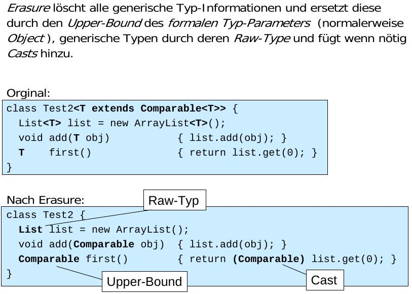
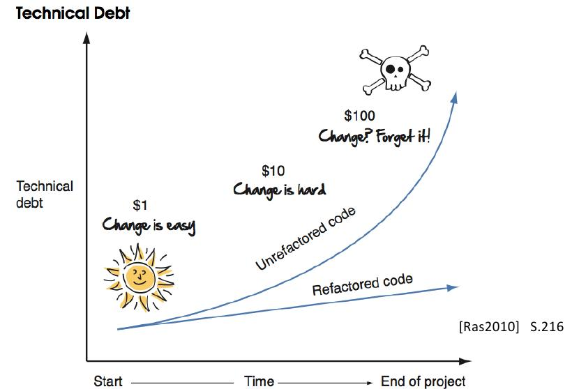

================
FS14 SE3 Summary
================

1 Java Advanced
===============

* Modellierung: Sicherheit sehr entscheidend (z.B. Typisierung, ...) und beeinflusst die Entscheidungen während der Modellierung.

::

	Compile
	    Linking
	        Runtime
	------------------> t

* Fehlerfall soll so früh wie möglich auftreten (Kompilierung), nicht beim Linking oder zur Runtime.
* Beim Design kann oft entschieden werden, zu welcher Zeit Fehler auftreten (z.B. Typisierte Liste oder untypisierte).

1.1 Generics + Vererbung
------------------------

.. image:: img/1.1.jpg

* Generics führen dazu, das falsche Datentypen zur Compilezeit und nicht zur Laufzeit auftreten!

* UML Varianten
	* Formaler Paramter geht über in Person: <<bind>> <E -> Person> auf der implementationslinie zwischen List und RealList
	* Nur RealList Klasse: RealList : List<E -> Person>
* Legale Zuweisung: wenn vom gleichen Typ oder von abgeleiteten Type (wenn b auch ein a ist) -> String ist auch ein Object.
	
* Beispiel1
	.. code-block:: java

		List<String> ls = new ArrayList<String>();
		List<Object> lo = ls;
		
		// Zuweisung ist nicht legal auch wenn vom gleichen Typ 
		// oder von abgeleiteten Type

* Beispiel2
	::
	
		List<Student> ls = ...
		List<Person> lp = ...
		lp = ls; 	// Illegal, weil statischer Typ Person und damit der 
				// Studentenliste Angestellte hinzugefügt werden 
				// können. -> unterlaufen der Typisierung.
		
		
* Beispiel3
	.. code-block:: java
	
		void printCollection(Collection<Object> o) { 
			// ...
		}
		Collection<Person> persList;
		
		// ...
		
		// Parameterübergabe entspricht Zuweisung!! da call by value
		printCollection(persList); // Error, da Collection<Person> != Collection<Object>
		
		
	.. code-block:: java
	
		Wil
		void printCollection(Collection<?> o) { 
			// ...
		}

* **Student ist eine Person ABER Studentenliste ist keine Personenliste.**
* **G<Derived> ist kein abgeleiteter Typ von G<Base>**

1.2 Wildcards
-------------

.. image:: img/1.5.jpg

* <?> entspricht <? extends Object>

1.2.1 Upper Bound Wildcard
..........................

* Erlaubt sind Person oder tiefer (Student, ...)

.. code-block:: java

	List<String> erzeugeNamensList(List<? extends Person> personenListe);
	
	
.. image:: img/1.6.jpg

* Schreibender Zugriff nicht erlaubt, weil damit falsche Typen in List eingetragen werden könnten.
* Compiler löst dies, in dem er alle Methoden verbietet, die den Typ in der Parameterliste führen.

1.2.2 Lower Bound Wildcard
..........................

* Erlaubt sind Studenten oder höher (Person, Objekt, ...)

.. code-block:: java

	List<String> erzeugeNamensList(List<? super Student> personenListe);

.. image:: img/1.7.jpg

* Problem: Funktionen von Tiefer Klassen könnten in höherer Klasse nicht vorhanden sein -> KEIN lesender Zugriff.
* Compiler löst dies, in dem er alle Methoden, die den Typ zurückgeben (z.B. get(0)) verbietet.

1.2.3 Zusammenfassung Lower/Upper-Bound
.......................................

.. image:: img/1.8.jpg

**-> keine Methoden Typisieren, die gar nichts mit dem Objekt machen, weil diese sonst bei upper oder lower bound nicht mehr verfügbar wären.**

.. code-block:: java

	public boolean contains(Object o); // statt E

1.3 Generische Methoden
-----------------------

.. image:: img/1.9.jpg

1.4 Raw Type
------------

1.5 Erasure
-----------

.. image:: img/1.11.jpg

1.5.1 Bridge Methoden
.....................

.. image:: img/1.13.jpg

VM Müsste eine noSuchMethod Exception werfen, weil durch die Übergabe des Integers nach einer Methode mit Integer Signatur gesucht wird. Damit dies nicht passiert, wird eine Bridge Methode generiert.

Die Bridge Methode Enthält Object in der Signatur und versucht anschliessend zu Casten.

.. image:: img/1.14.jpg

1.5.2 Class Sharing
...................

.. code-block:: java

	List<String> l1 = new ArrayList<String>();
	List<Integer> l2 = new ArrayList<Integer>();
	System.out.println(l1.getClass() == l2.getClass()); // true
	

Alle Instanzen einer generischen Klasse benutzen die durch Erasure erzeugte, einzige Klasse !
Somit ist auch Interoperabilität von Generic- und Legacy-Byte-Code sichergestellt !

1.5.3 new T()
.............

* Wird von Java nicht zugelassen, da der Compiler nicht garantieren kann, das T einen Defaultkonstruktor besitzt. -> Cannot instantiate the type T
*  Aufgrund des Erasure würden die formalen Typ-Parameter durch Object (resp. durch einen allfälligen Upper-Bound ) ersetzt:

	.. code-block:: java
	
		MyClass<String> mc = new MyClass<String>();
		String str = mc.getData(); // String = Object -> ClassCastException

1.5.3.1 Mögliche Alternativen
'''''''''''''''''''''''''''''

a) Objekt wird von aussen übergeben: Nachteil: Datenkapselung wird umgangen.
	
	.. code-block:: java
	
		class MyClass<T> {
			private T data;
			MyClass(T data) {
				this.data = data;
			}
		}

	

b) Classtype wird übergeben und mittels Reflection eine Instanz erzeugte
	
	.. code-block:: java
	
		class MyClass<T> {
			private T data;
			MyClass(Class<T> dataType) throws Exception {
				data = dataType.newInstance();
			}
		}

	

2 AOP
=====

.. note:: AOP: Aspect Oriented Programming

2.1 Separation of concerns
--------------------------

* Code wird zentral definiert und anschliessend in die Applikationslogik eingewebt. -> Einzelne Gebiete/Belange werden voneinander getrennt.

2.2 AspectJ
-----------

* **JoinPoints**: Mögliche Einwebestellen
	* Constructor-/ Methodenaufruf
	* Attributzugriff
	* Exceptionbehandlung
* **Pointcut**: Definitionen, wo eingewoben werden soll
* **Advice**: Eingewobenes Snippet
* **Aspect**: An best. Stelle eingewobenes Snippet (Pointcut+Advice)

.. code-block:: java

	public class Entry {
		protected User author;
		protected User owner;
	
		public void Entry() { /* ... */ }
		
		public void edit() { /* ... */ }
		public void view() { /* ... */ }
	}
	
	
.. code-block:: java

	public aspect EntryAccess {
		pointcut edit() : call(* Entry.edit(..));
		
		// Methodenaufruf nur erlauben, wenn User Owner ist
		around(): edit() && target(entry) {
			if(Context::getUser() == (Entry) entry.owner) {
				proceed();
			}
		}
	}

3 References
============

   Für das Programm nicht mehr erreichbare Objekte werden vom Garbage-Collector automatisch gefunden und freigegeben.

3.1 Lebenszyklus eines Objekts
------------------------------

.. figure:: img/3.3.jpg

3.2 Resurection
---------------

Innerhalb von finalize() kann das Objekt wieder erreichbar gemacht werden (z.B. Übergabe von this an ein erreichbares Objekt welches diese Referenz dann wieder speichert)!

**Resurrection (Wiederauferstehung)**

**Beachte:**
Die finalize()-Methode wird vom Garbage-Collector garantiert nur einmal aufgerufen. Dies ist bei bewusster Resurrection zu berücksichtigen!

.. figure:: img/3.4.jpg

3.3 Schwache Referenzen
-----------------------

.. figure:: img/3.6.jpg

   java.lang.ref.Reference

* **Weak-Referenzen** Lösche Objekt sobald es von der Applikation nicht mehr referenziert wird.
* **Soft-Referenzen** Behalte Objekt so lange es geht. Lösche erst, wenn nicht mehr genügend Memory vorhanden ist."
* **Phantom-Referenzen** Benachrichtige mich bevor das Objekt gelöscht wird.

   Erreichbarkeit

3.4 Soft Reference
------------------

* Nur über Soft- oder schwächere Referenzen erreichbar. -> Kann vom GC abgeräumt werden da softly reachable
* Bevor eine OutOfMemory-Exception geworfen wird, müssen alle softly-reachable Objekte weggeräumt sein.
* Alte und wenig benutzte Objekte sollen zuerst gelöscht werden

.. image:: img/3.8.jpg

3.5 WeakReference
-----------------

* Objekte, die nur über Weak- oder schwächere Referenzen erreichbar sind
	* -> können vom GC abgeräumt werden.

.. figure:: img/3.9.jpg

   WeakReference Beispiel: Singleton

3.6 ReferenceQueue
------------------

* Eine Referenz-Queue erlaubt es dem Programm herauszufinden, wann ein Objekt Soft-, Weak- resp. Phantom-Reachable wird.
* Objekt Ref. Kommt in schwachen Zustand -> GC schreibt es in Queue

3.7 PhantomReference
--------------------

* Spezialfall der schwachen Referenzen
* Erlauben keinen Zuriff auf das eigentliche Objekt
* Wenn Objekt Phantom reachable wird, ruft der GC finalize() auf und verschiebt die Referenz in die die ReferenceQueue
* Unterschied zu Soft- und Weak Referenzen: Diese werden in die Queue geschrieben, sobald sie "collected" sind. -> man weiss nicht, ob finalize() schon ausgeführt wurde wenn man sie aus der queue ausliest.
* GC löscht Objekt erst, wenn aus der App heraus darauf clear() aufgerufen wird.

3.8 Runtime
-----------

.. image:: img/3.10.jpg

4 Agile Entwicklung
===================

.. figure:: img/4.1.jpg
   :width: 90 %

   RUP zur Repetition

   
   
4.1 Scrum
---------

* Iterativ wie RUP
* Sprints entsprechen Iterationen
* Sprintziele sollten während Sprint nicht verändert werden
* Sprint dauert bis zu Monat
	* Rhytmus finden

.. image:: img/4.4.jpg
   :width: 100 %

	
Rollen
......

.. image:: img/4.6.jpg
   :width: 60 %
   :align: left

* Product Owner 
	* Vertritt Interessen des Auftraggebers
	* priorisiert Backlog
* Product Backlog
	* Beinhaltet Features, die umgesetzt werden soll, ev. auch User Stories
* Scrum Master
	* Coached das Team
	* Steht bei Problemlösung zur Seite
	* Kein Projektleiter! sondern eine DL für das Entwicklungsteam
* Team
	* Ist als ganzes verantwortlich dafür, das die Software entwickelt wird
	* ist selbstorganisiert

	
Meetings / Vorgehen
...................

* Team schätzt Aufwand für Backlog Features
* Product Owner kann nur Backlog priorisieren, aber nicht definieren, was in Sprint alles gemacht werden soll. Das Team definiert, was drin liegt.
* Aus Backlog entstehen Tasks, die nicht länger als einen Tag dauern sollen
* Tägliche Scrum Meetings (bis zu 15')
	* Jedes Teammitglied teilt mit, was es gemacht hat und wo es Probleme gibt
	* Stand-up Meeting, damit es nicht ausartet
	* Product Owner nicht dabei
* Sprint Review
	* Mit Product Owner

Ergebnisse
..........

.. image:: img/4.8.jpg
   :width: 60 %

Prinzipien
..........

4.2 Agiles Manifest
-------------------

* Zusammenarbeit zwischen Personen ist wichtig
* Funktionierende Software ist wichtiger als umfangreiche Doku
* Zusammenarbeit mit Kunden ist wichtiger als juristische Absicherung
* Reagieren auf Änderungen ist wichtiger als striktes Folgen des Planes
* Selbstorganisierende Teams, Vertrauen
* Architektur darf trotzdem nicht vergessen werden

4.2.1 Prämisse agiler SoDwareentwicklung
........................................

1) Es ist nicht möglich, alle Anforderungen zu Projektbegin zu erfassen
2) Anforderungen ändern sich während dem Projekt
3) Es gibt immer mehr zu tun als Zeit und Geld zur Verfügung stehen

4.2.2 Agile Planung
...................

.. image:: img/4.9.jpg
   :width: 90 %

4.2.3 Ziel jeder Iteration
..........................

* Nutzen (lauffähiges Produkt) für Kunden liefern

.. image:: img/4.10.jpg
   :width: 90 %

4.2.4 Fortschritt an "Working Software" messen
..............................................

4.2.5 Agiles Team
.................

.. image:: img/4.12.jpg
   :width: 75 %
   :align: left
   

* Team ist für das ganze verantwortlich
* Jeder übernimmt jede Rolle, was gerade zu tun ist
* Keine "Siloverarbeitung"
* Leute, die nur Fachidioten sind können nicht gebraucht werden

.. image:: img/4.14.jpg
   :width: 50 %

4.2.5 Erfolgsfaktoren für agile Teams
.....................................

.. image:: img/4.13.jpg
   :width: 90 %

.. image:: img/4.15.jpg
   :width: 90 %

.. image:: img/4.16.jpg
   :width: 90 %

4.2.6 Inception Desk
....................

.. image:: img/4.17.jpg
   :width: 90 %

4.3 User Stories
----------------

* Softwareanforderung aus Benutzersicht
* Kurz (1-2 Sätze)
* Sagt nur, um was es geht

::

	As a <type of user>,
	I want <to perform some task>
	so that I can <achieve some goal/benefit/value>.
	

.. figure:: img/4.18.jpg
   :width: 90 %

   Gute User Stories bringen Wert für Kunden

* User Stories sollten über alle Schichten laufen
* User Stories müssen unabhängig sein -> Priorisierung durch Product Owner möglich
* User Stories sind klei und lassen sich gut schätzen

.. note:: User Stories werden erst zum Moment der Umetzung ausgearbeitet

.. image:: img/4.19.jpg
   :width: 90 %

.. image:: img/4.20.jpg
   :width: 90 %

Story-Gathering Workshop
........................

.. image:: img/4.21.jpg

5 Aufwandschätzung & Planung
============================

* Schätzung zu Projektbegin: Keine genaue Aufwandabschätzung sondern
	* ungefähr Rescourcen und Zeit
	* ist das Projekt realistisch?

   The Cone of Uncertainity

Agiles Schätzen
---------------

* relative Schätzungen einfacher als absolute
* User Stories im Team schätzen (Mit Story Poinst statt Personentagen rechnen)
	* Punkte definieren Grösse der Aufgabe, nicht direkt Zeitdauer

.. image:: img/5.3.jpg
   :width: 90 %

.. image:: img/5.4.jpg
   :width: 90 %

* Schätzung erweist sich als falsch -> neu schätzen
	* Relative grösse der User Story bleibt -> nicht neu schätzen -> Burndown Rate erhöhen
* Schätzen nicht möglich -> Prototyp bauen in nächster Iteration
* Grosse Stories unterteilen

Agile Planung
-------------

   

Statische Planung vs Agile Planung
..................................

.. image:: img/5.6.jpg
   :width: 70 %
   
   
Agile Planen
............

.. image:: img/5.7.jpg
   :width: 90 %

   
   Flexibilität des Umfangs: Kommen neue Elemente hinzu, müssen alte raus!

Der Plan
........

1) Master Story List erstellen
2) Ersten Release planen
3) Schätzen
4) Priorisieren
5) Team Geschwindigkeit schätzen (Stories / Iteration)
6) Festlegen auf Termin oder Umfang

.. image:: img/5.9.jpg
   :width: 80 %

.. figure:: img/5.10.jpg
   :width: 80 %

   Burn Down Rate in der Praxis

   
   Burn Down Rate mit neuen Features

6 Agile Entwicklungsmethoden & Management
=========================================

   
   Technical Debt
   

* Test Driven Development (Hohe Testabdeckung)
* Continious Integration (Kontinuierliches Zusammenführen der lokalen neuen Features der einzelnen Entwickler um das Zusammenspiel im Auge zu behalten)

Managment agiler Projekte
-------------------------

* Analyse & Design nur für das durchführen, was gebraucht wird -> JIT Analyse für den Rest

Iteration Plannin Meeting IPM
.............................

* Am Ende der Iteration
* Besteht aus
	* Scrum Sprint Review
	* Planning next iteration
		* Stories müssen vorher geschätzt, priorisiert und analysiert worden sein
		* Festelgung der Stories für nächste Iteration
		* Kunde + Team zusammen
	* Allgemeinen Rückblick
		* Mini Project Health Check

Daily Stand Up Meeting
......................

Jeder berichtet:
* Was gestern getan
* Was für heute geplant
* Was beindert die Arbeit

